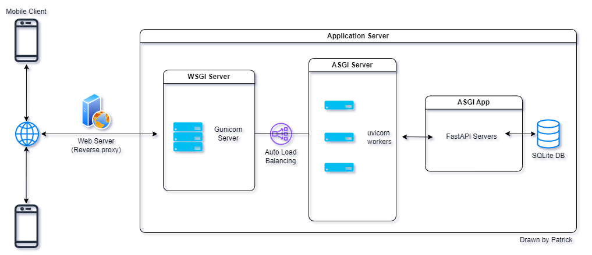

This is what a FastAPI app using Gunicorn managing Uvicorn workers may look like in a nutshell:  

<!-- uvicorn are part of wsgi server when managed by gunicorn -->
<!--  -->
  

### Web Server vs Application Server vs Web Client
**Web servers** are especially good at serving static content, they are also good at caching, load balancing, and doing reverse proxy. Apache and Nginx are common web servers.  

**Application servers** are designed to run application code, they are good at handling dynamic content, and they can run multiple languages.

**Web clients** are the browsers that we use to access the web, such as Chrome, Edge, Firefox, etc.  

### WSGI & ASGI
WSGI stands for **Web Server Gateway Interface**, it is a standard interface between web servers and Python web apps or frameworks. WSGI can handle synchronous code, establishing short-lived connections, such as HTTP requests.

ASGI stands for **Asynchronous Server Gateway Interface**, it is also a standard interface between web servers and Python web applications or frameworks. ASGI can handle asynchronous code, establishing long lived connections, such as WebSockets, HTTP/2 reequests.  

### Gunicorn
Gunicorn is a Python WSGI HTTP Server, it creates a main process that manages a set of worker processes. You can run Gunicorn with a FastAPI app, and Gunicorn will manage the FastAPI app in multiple worker processes. Every process will be running its own ASGI server(single threaded). By doing this, your app can handle multiple requests simultaneously. Gunicorn will do the load balancing automatically.

`gunicorn -w 5 -k uvicorn.workers.UvicornWorker main:app --access-logfile access.log --error-logfile error.log`

When deploying FastAPI apps we use Gunicorn(WSGI), which is actually managing ASGI servers(uvicorn), the `-k` part, assigning the worker type that is using. The app is actually still running on ASGI server, not running using WSGI. ^b0cb70

`-w 5` means 5 workers, can handle up to 5 requests simultaneously (simplify explaination)