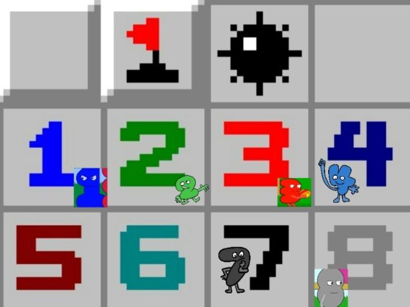

I discovered that using Ansi-escape can do cool things on the terminal, so I wrote an easy minesweeping game that outputs colorful numbers and stuff.  
I was pretty satisfied with the result. I no longer need to torture my eyes, staring at the black-and-white terminal output for debugging.
## Colorful Minesweeper
Here are the types of cells:  
1. '#' cell, anything can be under it. Mind your step!
2. Number cells, just like the classic Minesweeper game, represent the mines around it (1–8).
3. Blank cells, you reveal the grid and there are no mines around it.
4. 'F' cells, the flag, you can set flags to mark where a potential mine is. Flagging all mines correctly to win the game.
5. '*' cells, KABOOM! You stepped on a mine and game over.

<div class="image-row">


</div>

<div class="image-row">


</div>


When the difficulty sets and the game initializes, the program randomly places the mines on the board. I used a recursive approach to reveal the grids when a cell is selected.  

For the color output and some other commands, I referred to [this](https://gist.github.com/fnky/458719343aabd01cfb17a3a4f7296797).




<!--  -->
<!-- Minesweeper number colors -->

---

I found out that ansi escape can do more than just change the color of the terminal output. I decide to learn further about the fundamentals and make some more cool stuff. A clickable Minesweeper game came into my mind.  

### How to interact with the terminal via mouse click?
This was the problem I immediately encountered. After searching StackOverflow and some documents, this [doc](https://invisible-island.net/xterm/ctlseqs/ctlseqs.pdf) was what I found most complete.  

Well, it does give me some idea, but I got very little progress with the implementation. After some hours of trying, I finally figured it out!  
### First Problem
To let the terminal listen to mouse click events, I use the Normal Tracking Mode.
```c
printf("\033[?1000h");  // to enable mouse support
```
The code to listen to mouse click events:
```c
// ESC[M{button};{x coordinate};{y coordinates}
char input[7];
fgets(input, sizeof(input), stdin);

int button, row, col;

//if is mouse click event
if (input[0] == '\033' && input[1] == '[' && input[2] == 'M'){ 
  
  // extract button number, column, and row
  sscanf(input, "\033[<%d;%d;%d", &button, &row, &col); 
  button = input[3] - ' ';

  // the processing here is my format, modify it if you are using your format
  // it is for turning terminal coordinates to cell coordinates
  col = (int)((input[4] - ' ' - 1) / 2);
  row = input[5] - ' ' - 1 - EDGE - 3; 
}
```

### Note that:
- Mouse click event can be read from stdin  
- (0, 0) locates at the top-left corner of the terminal, every char is an unit length

Clicking with your mouse on the terminal when mouse support is enabled, the input will likely be something like this: `\033[M<0;3;5`  

`'\033'` is the Control Sequence Introducer (CSI), which indicates the start of a control sequence. 'M' indicates that a mouse button event has occurred.  
0 is the mouse clicked, 3 and 5 are the (x, y) coordinate you clicked on the terminal.  

In the button part, 0 indicates left mouse click, 1 for scroll wheel click, and 2 for right mouse click.
```c
if (button == 2)    
     flag(row, col);  // if user click right mouse, set flag
```
The rest is the same as the normal Minesweeping game.
### Second Problem
The terminal will echo the content I inputted, which is the `ESC[[M<0;3;5` stuff.
To enable/disable terminal echo, I used the "termios.h" library.
```cpp
void enableTerminalEcho(bool enable) {
    struct termios term;
    tcgetattr(fileno(stdin), &term);

    if (enable)
        term.c_lflag |= ECHO;
    else
        term.c_lflag &= ~ECHO;
    tcsetattr(fileno(stdin), TCSANOW, &term);
}
```

[c_lflag](https://www.gnu.org/software/libc/manual/html_node/Local-Modes.html) can control various terminal behavior on a UNIX-like OS. Such as ECHO, ICANON, and ISIG.  

The ICANON flag is responsible for enabling canonical input mode, which buffers user input until a newline character (\n) is received. Disabling it can solve the issue that we need to press enter after every click during the game. It can also be applied to other games where real-time input processing is required.  

When ending the game, remember to enable the terminal echo and disable mouse support.
```c
printf("\033[?1000l"); // disable mouse support
enableTerminalEcho(true);   
```
Not all CLI can listen to mouse-click events, it'll be better if you run the program on a Linux system.  

*Source code can be found here: [GitHub](https://github.com/patty111/minesweeper)*  

*Still got some parts that need to improve. I'll update them when I am available. It will be great if you leave a clap. Any discussion or suggestion is welcomed!*