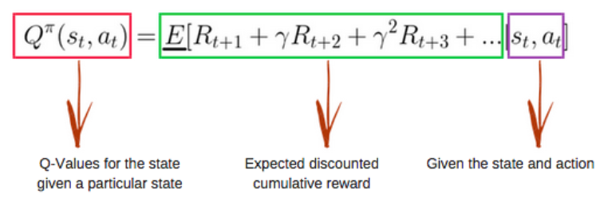

### Intro
Value Based RL, 透過記錄學習過的策略，來告訴智能體(Agent)，什麼情況下要對應採取什麼行動(Action)會得到最大的獎勵（Reward） 

在QLearning中有兩個重要的概念： **Exploration & Exploitation**，用來決定在每個state要探索 (Explore)還是依過往經驗 (Exploit)來採取行動。

### Variables
##### alpha
學習率, $0<\alpha\leq1$
##### gamma
衰減率, $0\leq\gamma\leq1$  
$\gamma$ 越大, Agent便更加重視未來獲得的長期獎勵，反之則更短視近利

##### epsilon
$0\leq\epsilon\leq1$, 決定採取exploitation  or exploration. 越靠近1越隨機


### Base Structure
```python
class QLearning:
	self.n_states = 5

	self.action: list of actions
	self.action_size = len(self.action)

	self.alpha = 0.1
	self.gamma = 0.95
	self.epsilon = 1.0
	self.epsilon_min = 0.01
	self.epsilon_decay = 0.995

	self.q_table = pd.DataFrame(np.zeros((self.n_state, self.action_size)),
								columns=self.action)
```

假設我在用QLearning做trading strategy, 設定的state是前n days daily price changes, 就會是一個 n-d array, 就不適用傳統的Q Learning. QValue 計算的方法就需要用其他 function approximator (一個neural network).  
而當我們不只簡單的加上一個NN，還加上如Experience Replay, Target Network...等等，就會變成 DQN。
### Epsilon Greedy
用來決定exploitation or exploration.  
每次Agent都有 $1-\epsilon$ 的機會採取argmax行動，代表依照過往經驗選出的最優解，$\epsilon$的機率隨機選取action (explore). 隨著epsilon慢慢的衰減, agent會用越來越多的exploitation.   
```python
def greedy_epsilon(self, state):
    # exploration
    if np.random.rand() <= self.epsilon:
		return np.argmax(self.q_table[state, :])    
        
    # exploitation
    return random.choice(self.action)
```

### Bellman Equation
Updating Q table base on immediate reward and estimates future reward
  

$$
Q(s, a) \gets Q(s, a) + \alpha[r + \gamma max_{a^{\prime}} Q(s^{\prime}, a^{\prime}) - Q(s, a)]
$$
```python
def learn(self, state, action, reward, next_state):
    q_predict = self.q_table[state, action]
    q_target = reward + self.gamma * np.max(self.q_table[next_state, :])
       
    self.q_table[state, action] += self.alpha * (q_target - q_predict)
```