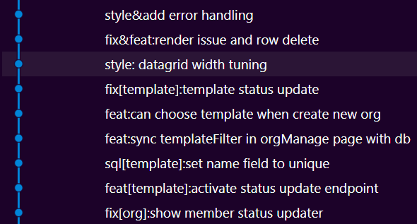
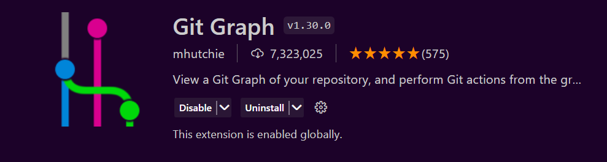

### What is Git? Github?
Github簡單來說是一個線上原始碼存放的平台。Git 則是一個版本控制的工具，許多平台(如Github, Gitlab) 都依靠這個工具運作，兩個是不一樣的東西。

<!--more-->
### Why Git?
Git可以做分散式的版本控制，對程式歷史紀錄追蹤、多人協作等狀況有很大的幫助。基本上我覺得任何程式只要你把它當作專案來看就應該要做版控，更何況是多人專案。手動merge或是歷史追蹤回檔真的不是人幹的。Git是不論寫程式或是想當工程師必學的一個工具，雖然指令多且複雜，好處是平常多只需要少部分的內容就能應付大部分情況。

### How to Use Git?
以下我都以git整合github為前提:
#### 1. 下載Git
#### MacOS/Linux
電腦是MacOS或是Linux系統的話應該本身就會有git。  
如果你的Mac電腦沒有的話可以在[git官網](https://git-scm.com/downloads)或是用`brew install git`來安裝。  
如果你的電腦沒有homebrew或類似的管理工具... 那建議你該裝一下。
#### Windows
一樣去[官網](https://git-scm.com/downloads)裝。  

>下載完可以開啟terminal輸入 `git -v`，應該會返回一串version number，代表安裝成功。
#### 2.初始化 Git Repo
```shell
mkdir <folder-name>
cd <folder-name>
git init
```  
如果你是要從Github複製現成的repository:  
```bash
git clone <your-target-repo-url>.git
```
第一次clone下來之後要再次同步:
```bash
git pull
```
#### 3. 對你的專案做操作
#### 4. Stage你的操作
Stage有點像是git在跟你做確認要把哪些事件寫到歷史紀錄裡面，以檔案為單位。  
Stage全部修改到的檔案: `git add .`
Stage特定幾個檔案，如果加了a.cpp, b.cpp和 b.js，只想stage .cpp files: `git add a.cpp b.cpp`  
#### 5. Commit
commit 類似把跟你確認好的操作寫到歷史紀錄裡。  
`git commit -m "You Commit Msg"`

#### 6. 把你的本地repo與github repo做連結
如果你的repo是clone下來的就跳過這個步驟  
`git remote add origin <your-github-repo-url>`
#### 7. 把本地repo同步到github repo
第一次`git push -u origin main`，之後用`git push`就可以了。  

### Branches(分支) and Why to Use Them?
分支可以讓你在做測試或是修改的時候不會動到重要脆弱的原始碼。簡化的分支使用可以參考以下分法:  
- main(or master) branch: 主要的分支，通常是穩定或是發行的版本
- dev branch: 通常長期存在，用於將個別開發的feature合併至此做確認整合，最後才會合併到main branch
- feature branch: 可能會同時有好多個，你可以每要開發一個獨立的功能就開一個feature branch，開發完成再合併到dev branch
> 詳細內容可以參考Github flow strategy 或是其他策略  
#### Basic Commands
```shell
# show all local and remote branches
git branch -a
# open a new branch
git branch <your-branch-name>
# delete a local branch
git branch -d <your-branch-name>
# switch to designated branch
git checkout <your-branch-name>
```
### Merge(合併)
前面提到在開發的時候可能會開多個branch, 那要如何整合呢?這時候就需要用到merge指令。  
假設我現在有一個檢查過準備要合併到main branch的dev branch:
```shell
git checkout master
git merge dev
```
merging的行為會成為一個新的commit。有時候會碰到merge conflict的狀況，這個時候就需要先resolve conflict才能continue merge。

### Conventional Commits
前面在做git commit的時候需要留下一段話，通常用於記錄這次的commit做了甚麼事。有些人會因為偷懶亂寫如 `git commit -m "."`等等。    
我們來看看以下的git log:
```shell
commit 5f298df0b781e546fc7afcf400d65b56f6c45d00 (HEAD -> master)
Author: 
Date:   Thu Mar 7 00:17:09 2024 +0800
    -
commit cadbda55c69d8784faffa59c26d3f10ee45e0c58
Author: 
Date:   Thu Mar 7 00:16:40 2024 +0800
    .
commit 4feefc0d3e67a3e4fc7103f6e44f231c4b351648
Author: 
Date:   Thu Mar 7 00:16:12 2024 +0800
    haha
```
你知道我在哪一次commit裡面寫了a.py來印出hello world嗎?這還是專案不大的時候，像是下面這個專案有上百條commit還有5個branch，不好好寫commit message絕對搞死你:

好好寫commit message是不是就能大概知道每個commit在做什麼~  

---

通常在開源專案或是企業內部會有自己一套的規則，而比較通用、書中可能會出現的就是Conventional Commit
```
# good commit message:
<type> [scope]: <Description>
```
#### Type
常見或比較通用的type(以下type為大致分類，每個人的分類多少有出入)
- feat: 新增功能
- chore: 非新增功能或是修補行為，如清理檔案
- fix: 解issue或是修bug
- refactor: 重新命名檔案或是改寫程式碼(for clean code)
- docs: 更新文檔如README files
- style: 格式變動，如 空白、逗號、輸出格式等等
- performance: 效能改善
- revert: 退版
- test: 測試相關
- build: 會影響到建置相關的環境或是相依性套件設定
#### Scope
Optional, 表示改動到的範圍。可以是檔案、function或是功能
#### Description
用簡短有意義的文字描述你做的變動
```shell
# example commits
git commit -m "feat[hw project]: create homework project file"
git commit -m "chore[package.json]: Install Vant UI Components"
```

有時候我們想做更詳細的描述就會用到以下格式
```shell
<type>[optional scope]: <Description>

[optional body]

[optional footer(s)]
```
這個時候就不能用`git commit -m "your msg"`, 用`git commit`指令就可以了。git會自動打開預設的文字編輯器。  
要改動預設編輯器可以使用以下指令:  
`git config --global core.editor <your-preferred-editor>`  

### Tools and Tips
#### Git Graph
如果你的編輯器使用的是vscode推薦git graph這個套件，他可以視覺化git的歷史紀錄，方便追蹤，超級方便。  

#### Git Alias
有些日常常用的指令組合如
```shell
git add .
git commit -m "commit msg"
```
或是如`git checkout` 字很多，這時候就可以用alias(別名)的功能。  
如前面add & commit我可以改成
```shell
git ac "commit msg"
```
要新增/移除 alias可以開啟 .gitconfig file, 通常在 rootfolder (~) 底下，通常是隱藏的，所以要開啟顯示隱藏檔案才看的到，或是如果你有vim/nvim可以直接`vim ~/.gitconfig`，接著加入[alias]並在底下加入你的縮寫(如下面範例)  
  
下面的nah指令是我在twitter上面抄來的(忘了詳細的來源QQ)，可以很徹底的重設local的狀態，當你不小心寫了一團糟的時候真的是救星。

```shell
[filter "lfs"]
	clean = git-lfs clean -- %f
	smudge = git-lfs smudge -- %f
	process = git-lfs filter-process
	required = true
[user]
	name = 'your nickname'
	email = 'your email'
[core]
	editor = nvim
	longpaths = true
[alias]
	nah = "!f() { git reset --hard; git clean -df; if [ -d \".git/rebase-apply\" ] || [ -d \".git/rebase-merge\" ]; then git rebase --abort; fi; }; f"
	ac = '!f() { git add . && git commit -m "$1"; }; f'
```


### 延伸議題
- Merge Conflicts
- Pull Request(PR)
- Rebase
- git stash
- git blame
- and many many more...
